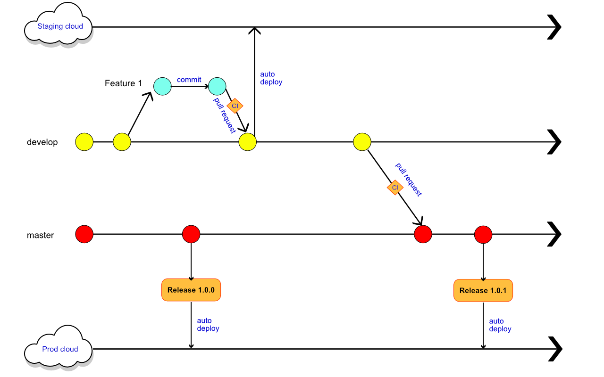

# DOCUMENTATION OF THE CONSTRUCTION 	AND ORGANISATION OF THE PROJECT

# Git Flow



## Commits rules
a. First, 1 commit by feature

b. commit title and description rules  
```sh
    <type>:<subject>
    <description>
    example:
    feat:Add Sass instead of css
    Add npm Sass dependencies and replace in 
    angular-cli.json the stylesheet type in by sass
    
 ```
 
   for this we use precommit git hook
   
   ### Git Hook in precommit
   
   this project is set to use TSLint before commit and test commit rules
   
   if your code don't pass TSLint and commit rules your commit action are not executed
   
   we use husky npm package installed in this project to setup this fonction
   
   we use commitlint npm package to setup lint commit message in pre-commit
   
   you can see rules below:
   
   
   ```sh
       - `feat`: (new feature for the user, not a new feature for build script)
       - `fix`: (bug fix for the user, not a fix to a build script)
       - `docs`: (changes to the documentation)
       - `style`: (formatting, missing semi colons, etc; no production code change)
       - `refactor`: (refactoring production code, eg. renaming a variable)
       - `test`: (adding missing tests, refactoring tests; no production code change)
       - `chore`: (updating grunt tasks etc; no production code change)
       
    ```
    
    
   

